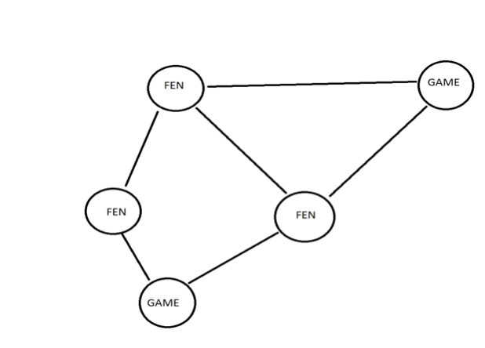

## Automating Novelty Detection in Large Chess Databases

The basic problem is:

(a) Given the record of moves in a game of chess, to find the earliest position p that is novel---i.e., has never appeared before in the entire recorded history of chess.

This problem is easy in principle.  Every chess position is specified by a so-called Forsyth-Edwards Notation (FEN) code. Databases on the order of 10 million games representing the history of chess are readily available.  An average game has about 35 moves by each player, hence 70 FEN codes of under 100 characters each, so even under naive encodings the database takes "only" 70 billion chars = 70GB.  We need only test each position code in a newly-presented game to find the first one that is not in the database of so-called "book" positions.

The problem becomes trickier under the following wrinkles, all of which are relevant to several prospective uses of the data---including automating the exclusion of "book moves" from statistical tests of allegations that human players have cheated by using a computer during games.  The World Chess Federation (FIDE from its French acronym) has had to deal with such allegations at an increasing rate since the scandal of the 2006 world championship match and a ramp-up of cases since 2010.  I am a regular advisor to FIDE's Anti-Cheating Commission and helped draft the ACC charter documents in 2013-14.

(b) We actually want the earliest position q such that q and all positions after q are outside of "book"---excepting positions toward the end of the game that are enumerated in a separate registry of "common endgame positions".  This q can differ from p because the given game might return to a book position b by a different order of moves than how b was arrived at in the past.

(c) We may further exclude from the "book" all moves by players under a specified skill threshold, such as 2300 on the Elo Rating scale used by FIDE.  This introduces the element of "move" besides "position" and requires formulating the idea of a chain of moves leading to q, each of which has been played by a sufficiently skilled player---though possibly in many different games.

The preeminent database tool in the chess world is ChessBase, marketed by ChessBase GMBH of Hamburg, Germany.  This provides only service (a) directly, (b) by hunt-and-peck sequentially through a game, and not (c) at all.  These two attempts to emulate (c) using ChessBase are incorrect: (i) Limiting to a database of all games between players both rated at least (say) 2300 misses the event that two games, one with only White being 2300+ and the other with only Black, could follow the same course of moves up to q.  (ii) Limiting to games with at least one player >= 2300 does not eradicate the central difficulty.  Moreover, several versions of ChessBase have been observed to show bugs on queries of type (a), let alone (b) or (c).

Abstractly, the project is trying to resolve the long-standing dichotomy between "position-based" and "moves-based" databases. In the 1980s and 1990s era of limited computing power, the difference in structure was palpable and hard to bridge.  Even more abstractly, we have a form of "alternating directed graph" and need to reconcile node-based and paths-based predicates. Optimizing the query time, as opposed to previous emphasis on conserving space via compact binary encodings, will be the driving objective.  It will be desirable to find a general solution that applies to other selection criteria besides Elo rating thresholds, so the mathematical nature of the problem will take precedence over chess-specific elements.

The project does not intend to automate the entire cheating-test process, nor host data private to FIDE.  It would constitute a public service that FIDE's private server could access. Implementing and testing an appropriate and standardizable communication protocol for such access is a second facet of the project.  To clarify: all data to be used by the project is indelibly in the public domain (recent court cases have affirmed that the record of moves is not copyrightable nor restrictable in other ways) and all data and data structures will be regenerable in case of catastrophic database corruption.


## Implementation details
### Introduction
I am using SOLR indexing software for storing and indexing this data for future querying purposes. SOLR is an open source indexing software from Apache software that can index millions of documents with efficient query mechanisms. SOLR can also act as a graph database but with only limited graph query capabilities. The graph that I am building stores various FENs and the Game information. This graph has 2 types of nodes, one type is of FEN and its properties and another type is of game information. Each FEN is linked to games where the FEN is played and other FENs that can be reached from the FEN, these links are the typical edges in any graph. This graph can help us in querying for various types of Chess data analysis queries. For example, a query like what all the games that a FEN is played in? is a simple BFS query from the FEN node but only looking for game type nodes in the search. Another query could be like Can we reach FEN x from FEN y? is a simple DFS query covering the depth and only looking for FEN type nodes. 

## A bit about SOLR
[Apache SOLR](http://lucene.apache.org/solr/features.html) is an indexing tool with rich query interface. It supports various queries like wild card search, exact queries and having type of queries etc. [Here](http://lucene.apache.org/solr/guide/7_2/solr-tutorial.html) is a resource that can get users started about SOLR and understand how querying works in SOLR. In this study, I have predominantly used graph query capabilities but all the other off-the-shelf queries supported by SOLR can be used as the data is already in the standard SOLR document format. Though SOLR is primarily built to support search engine like query interfaces, it also has good graph query capabilities. Main reasons behind using SOLR as data store are its graph capabilities along with rich query interface and my previous working experience on SOLR (not a compelling reason but there wasn’t much learning required for using SOLR).

### Data processing
I have built this graph from a preprocessed dataset that Dr. Regan has generated from his Chess database. This dataset has about 6.8 million games and 340 million unique FENs after excluding opening moves. This is a massive dataset that took days to process and has huge memory requirements to build the graph. I have a used a machine with 16 cores and 112GB of RAM for processing entire dataset at one go but that didn’t help in satisfying memory requirement for the process to finish. So, I had to break down FEN collection into multiple small chunks to fit them into memory. To be able to efficiently break down into small chunks of FENs, I needed to first create the distinct collection of FENs. However, creating this collection requires taking all the FENs into memory and then store only the unique FENs. This has similar memory requirements as above process, so this solution requires solving the above problem. So, basically, my problem’s solution requires solving the problem itself hence this is a dead end. Though above idea didn’t work out in it’s original form it still did help me in solving my problem with a different approach. I have collected unique FENs by black and white moves separated as two different datasets. This helped in bringing down the memory requirements to almost half and within the system memory. After generating these datasets, I have also created a list of all the games and stored them too. To create a FEN record I needed all the games in memory because FEN could occur in any game. So, I took all the games into memory and only a chunk of FENs into memory (~10 million) and processed FENs sequentially in batches. 

Here is how a typical FEN node looks like
```
{
  "FEN": "r1b1k2r/pp1nqppp/2p1p3/3n4/2BP4/2N1PN2/PPQ2PPP/R3K2R w KQkq",
  "Count": 10,
  "MovesByGame": [
    "1: Pd2-d4"
  ],
  "NextFEN": [
    "r2q1rk1/pp1bppbp/2np2p1/2pN4/4P1n1/3P1NP1/PPPB1PBP/R2Q1RK1 b",
    " r2q1rk1/pp1bppbp/2np2p1/2pN4/4P1n1/3P1NP1/PPPB1PBP/R2Q1RK1 b",
    " r2q1rk1/pp1bppbp/2np2p1/2pN4/4P1n1/3P1NP1/PPPB1PBP/R2Q1RK1 b"
  ]
  "TurnwiseCount": [
    "10,10"
  ]
}
```
All the fields are self-explanatory except for the MovesByGame field which has key-value pairs of a numerical and a move played in that game for the specified FEN. Keys in this MovesByGame file corresponds to all the games in which the FEN is seen i.e.  the adjacency list of the node in the FEN graph. Turnwise count is also a similar field which holds key-value pairs of various move turns where the FEN is seen. 


This is how a game node looks like
```
{
  "Id": 1,
  "Date": "2015-05-03",
  "Players": [
    "Player1",
    "Player2"
  ],
  "Ratings": [
    "2350",
    "2450"
  ],
  "Result": "1/2-1/2"
}
```
Sample graph looks like below




Note that only FEN node holds the edge information in this graph and Game node has no information about the neighboring FENs. This is by design as the queries that this graph is going to support are going to be FEN centric rather than game-centric. Though this is the current design, this design can be easily extended to make Game node hold all the edge information just like FEN node does

## Query support and challenges
Currently, this system is a rudimentary version of what could effectively become a sophisticated system with support for complex queries. For example, to support queries like all the games where a black player won and has a rating above 2300 seen a FEN I need to index both player ratings in separate fields so that it can be queried for. Currently, this query isn’t supported but this can design can be expanded to support for the above query with minimal effort. Another example would be to check if there is a path between two FENs but with all the intermediate nodes being part of a 2300+ rated player Games? Seems like an exhaustive search but with this current model running a BFS on a smaller graph that consists of only FEN nodes from Games with 2300+ players would yield a solution. Even building a tree of FENs from a point in the Game that lead to a draw is also a similar query but requires multiple subqueries for the result. All these queries require good query layer support as the user of this system is not expected to know the intricacies of efficiently querying SOLR. For a SOLR power user only indexing the data in the right format would suffice to query for the above complex query, which is just about finding what queries to support and indexing the data in that format. The Key thing to note here is expanding the system would not take away any existing functionality but it may require simple changes in querying mechanisms. This should go away once the query layer is implemented on top of SOLR so that user would always have same querying experience if not richer.


## Challenges
I faced two key challenges in this study. I already talked about how memory issue affected the processing of FENs and how I have overcome the memory problem. The other challenge was to store data in such a way that it is both efficient and can be queried for. I tried storing de-normalized data but it wasn’t very wise considering the volume of the data. So, I had to resort to a graph-like data structure. Each node could either be of type FEN or Game, so I only needed to store each FEN or Game information once and links are formed as edges in the graph. This helps in reducing the indexed data size by a factor but there is a slight increase in the query time as multiple hops are required for supporting graphs queries. This is reasonable if you look at the scale of the data that is being indexed and fair to expect the system to perform poorly for some complex queries.


## Roadmap
Whatever has been accomplished in this independent study helps in reducing the amount of work involved in analyzing FEN data. This also helps in querying FEN data efficiently and supports complex queries. However, this is still far from complete and can be improved in many ways. Adding more information at each node in this graph makes query interface rich. Though I have not scoped advanced queries in this study, I am hoping to finish these things over the next few months. Finally, making this FEN database open-source to help other Chess data researchers would be something that I hope to achieve in the near future.
